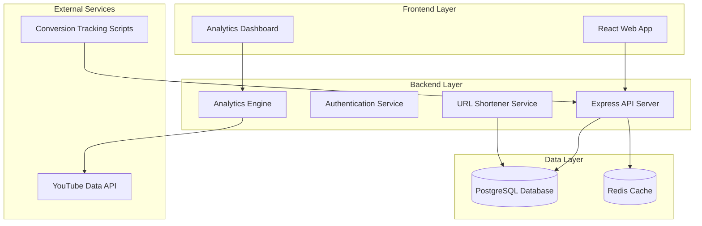

# Design Document

## Overview

The YouTube Campaign Click Tracker is a web-based system that provides comprehensive tracking and analytics for marketing campaigns linked from YouTube videos. The system consists of a React frontend, Node.js/Express backend, PostgreSQL database, and integrations with YouTube Data API for video analytics and various conversion tracking mechanisms.

## Architecture

### High-Level Architecture



### System Components

1. **Frontend Application**: React-based responsive SPA with mobile-first design
   - CSS-in-JS styling with responsive breakpoints
   - Progressive Web App (PWA) capabilities for mobile experience
   - Touch-optimized components and gesture support
2. **API Server**: Express.js REST API handling all business logic
3. **URL Shortener**: Service for generating and resolving shortened URLs
4. **Analytics Engine**: Component for processing clicks, conversions, and YouTube data
5. **Database**: PostgreSQL for persistent data storage
6. **Cache Layer**: Redis for performance optimization
7. **YouTube Integration**: Service for fetching video metadata and view counts

## Components and Interfaces

### Frontend Components

#### Campaign Management Interface
- **CampaignList**: Displays all campaigns with search and filtering
  - Mobile: Card-based layout with collapsible details
  - Desktop: Table layout with inline actions
- **CampaignForm**: Create/edit campaign details
  - Mobile: Single-column form with large touch targets
  - Desktop: Multi-column layout with enhanced validation
- **CampaignDetails**: Shows campaign overview with link management
  - Mobile: Tabbed interface for campaign info and links
  - Desktop: Side-by-side layout with real-time updates
- **LinkForm**: Add/edit campaign links with YouTube integration
  - Mobile: Step-by-step wizard interface
  - Desktop: Single-form layout with live preview
- **YouTubePreview**: Displays video thumbnail, title, and view count
  - Mobile: Full-width cards with touch-optimized controls
  - Desktop: Grid layout with hover interactions

#### Analytics Dashboard
- **AnalyticsSummary**: Campaign-level metrics and KPIs
  - Mobile: Vertical card stack with swipe navigation
  - Desktop: Dashboard grid with customizable widgets
- **LinkAnalytics**: Individual link performance with YouTube CTR
  - Mobile: Expandable list items with drill-down details
  - Desktop: Data table with sortable columns and filters
- **ConversionFunnel**: Visual representation of conversion steps
  - Mobile: Vertical funnel with touch-friendly interactions
  - Desktop: Horizontal funnel with detailed tooltips
- **RevenueAttribution**: Revenue tracking and attribution charts
  - Mobile: Simplified charts with gesture controls
  - Desktop: Interactive charts with advanced filtering
- **DateRangePicker**: Filter analytics by time periods
  - Mobile: Native date picker with preset ranges
  - Desktop: Calendar widget with custom range selection

#### Responsive Design System
- **Breakpoints**: 
  - Mobile: 320px - 768px
  - Tablet: 769px - 1024px
  - Desktop: 1025px+
- **Touch Targets**: Minimum 44px for all interactive elements
- **Typography**: Scalable font sizes using rem units
- **Navigation**: 
  - Mobile: Bottom tab bar or hamburger menu
  - Desktop: Top navigation with sidebar
- **Layout Grid**: CSS Grid and Flexbox for responsive layouts

### Backend API Endpoints

#### Campaign Management
```
POST   /api/campaigns              - Create new campaign
GET    /api/campaigns              - List all campaigns
GET    /api/campaigns/:id          - Get campaign details
PUT    /api/campaigns/:id          - Update campaign
DELETE /api/campaigns/:id          - Delete campaign

POST   /api/campaigns/:id/links    - Add campaign link
PUT    /api/campaigns/:id/links/:linkId - Update campaign link
DELETE /api/campaigns/:id/links/:linkId - Delete campaign link
```

#### URL Shortening and Tracking
```
POST   /api/shorten               - Generate shortened URL
GET    /:shortCode                - Redirect and track click
GET    /api/analytics/campaigns/:id - Get campaign analytics
GET    /api/analytics/links/:id   - Get link analytics
```

#### YouTube Integration
```
POST   /api/youtube/validate      - Validate YouTube URL
GET    /api/youtube/metadata/:videoId - Get video metadata
POST   /api/youtube/refresh-views - Refresh video view counts
```

#### Conversion Tracking
```
POST   /api/conversions           - Record conversion event
GET    /api/conversions/attribution/:trackingId - Get attribution data
```

## Data Models

### Database Schema

#### Campaigns Table
```sql
CREATE TABLE campaigns (
    id UUID PRIMARY KEY DEFAULT gen_random_uuid(),
    name VARCHAR(255) NOT NULL UNIQUE,
    description TEXT,
    tags TEXT[],
    created_at TIMESTAMP DEFAULT NOW(),
    updated_at TIMESTAMP DEFAULT NOW()
);
```

#### Campaign Links Table
```sql
CREATE TABLE campaign_links (
    id UUID PRIMARY KEY DEFAULT gen_random_uuid(),
    campaign_id UUID REFERENCES campaigns(id) ON DELETE CASCADE,
    short_code VARCHAR(10) UNIQUE NOT NULL,
    landing_page_url TEXT NOT NULL,
    youtube_video_id VARCHAR(20) NOT NULL,
    youtube_video_title TEXT,
    youtube_thumbnail_url TEXT,
    custom_alias VARCHAR(50),
    created_at TIMESTAMP DEFAULT NOW(),
    updated_at TIMESTAMP DEFAULT NOW()
);
```

#### YouTube Video Stats Table
```sql
CREATE TABLE youtube_video_stats (
    video_id VARCHAR(20) PRIMARY KEY,
    view_count BIGINT NOT NULL,
    last_updated TIMESTAMP DEFAULT NOW()
);
```

#### Click Events Table
```sql
CREATE TABLE click_events (
    id UUID PRIMARY KEY DEFAULT gen_random_uuid(),
    campaign_link_id UUID REFERENCES campaign_links(id),
    tracking_id UUID NOT NULL,
    ip_address INET,
    user_agent TEXT,
    referrer TEXT,
    clicked_at TIMESTAMP DEFAULT NOW()
);
```

#### Conversion Events Table
```sql
CREATE TABLE conversion_events (
    id UUID PRIMARY KEY DEFAULT gen_random_uuid(),
    tracking_id UUID NOT NULL,
    campaign_link_id UUID REFERENCES campaign_links(id),
    event_type VARCHAR(50) NOT NULL, -- 'newsletter_signup', 'purchase', 'course_enrollment'
    revenue_amount DECIMAL(10,2),
    event_data JSONB,
    converted_at TIMESTAMP DEFAULT NOW()
);
```

### Data Flow

#### Click Tracking Flow
1. User clicks shortened URL from YouTube video description
2. System records click event with tracking ID
3. User is redirected to landing page with tracking parameters
4. Landing page includes conversion tracking script
5. Subsequent actions are attributed to original click

#### YouTube Data Synchronization
1. Daily cron job fetches video view counts from YouTube API
2. View counts are updated in youtube_video_stats table
3. CTR calculations are refreshed for all active campaign links
4. Analytics dashboard displays updated metrics

## Error Handling

### API Error Responses
- **400 Bad Request**: Invalid input data or malformed requests
- **401 Unauthorized**: Authentication required
- **404 Not Found**: Resource not found (campaigns, links, etc.)
- **409 Conflict**: Duplicate names or aliases
- **429 Too Many Requests**: Rate limiting for YouTube API calls
- **500 Internal Server Error**: Unexpected server errors

### YouTube API Error Handling
- **Quota Exceeded**: Implement exponential backoff and retry logic
- **Video Not Found**: Mark video as unavailable, preserve historical data
- **API Unavailable**: Use cached data, display "updating" status
- **Invalid Video ID**: Validate format before API calls

### URL Shortener Error Handling
- **Invalid URLs**: Validate protocol and format
- **Duplicate Aliases**: Check availability before creation
- **Deleted Links**: Show user-friendly 404 page with campaign branding

## Testing Strategy

### Unit Testing
- **Backend Services**: Jest for API endpoints, business logic, and data models
- **Frontend Components**: React Testing Library for component behavior
- **Utility Functions**: URL validation, CTR calculations, date formatting

### Integration Testing
- **API Integration**: Test complete request/response cycles
- **Database Operations**: Test CRUD operations and data integrity
- **YouTube API Integration**: Mock API responses for reliable testing
- **Conversion Tracking**: End-to-end attribution flow testing

### Performance Testing
- **Load Testing**: Simulate high traffic on shortened URLs
- **Database Performance**: Query optimization for analytics aggregations
- **YouTube API Rate Limits**: Test quota management and fallback strategies

### Security Testing
- **Input Validation**: SQL injection, XSS prevention
- **Authentication**: JWT token validation and expiration
- **Rate Limiting**: Prevent abuse of URL shortening service
- **Data Privacy**: Ensure proper handling of tracking data

### Responsive Design Testing
- **Cross-Device Testing**: Verify functionality across mobile, tablet, and desktop devices
- **Browser Compatibility**: Test responsive layouts in Chrome, Firefox, Safari, and Edge
- **Touch Interaction Testing**: Validate touch targets meet accessibility guidelines
- **Orientation Testing**: Ensure layouts work in both portrait and landscape modes
- **Performance Testing**: Measure load times and interaction responsiveness on mobile networks

## Responsive Design Architecture

### Mobile-First Approach
The application follows a mobile-first design strategy, starting with mobile layouts and progressively enhancing for larger screens.

### Responsive Breakpoints
```css
/* Mobile devices */
@media (max-width: 768px) {
  /* Touch-optimized layouts */
}

/* Tablet devices */
@media (min-width: 769px) and (max-width: 1024px) {
  /* Hybrid touch/mouse layouts */
}

/* Desktop devices */
@media (min-width: 1025px) {
  /* Mouse-optimized layouts */
}
```

### Component Adaptation Strategies

#### Navigation Patterns
- **Mobile**: Bottom tab navigation or slide-out drawer
- **Desktop**: Top horizontal navigation with dropdown menus
- **Tablet**: Adaptive navigation based on orientation

#### Data Visualization
- **Mobile**: Simplified charts with essential metrics, swipe gestures for navigation
- **Desktop**: Comprehensive dashboards with hover states and detailed tooltips
- **Tablet**: Balanced approach with touch-friendly interactions

#### Form Layouts
- **Mobile**: Single-column forms with large input fields and touch-friendly buttons
- **Desktop**: Multi-column layouts with inline validation and keyboard shortcuts
- **Tablet**: Flexible layouts that adapt to orientation changes

### Touch Interaction Design
- **Minimum Touch Target Size**: 44px × 44px for all interactive elements
- **Gesture Support**: Swipe navigation for mobile carousels and lists
- **Haptic Feedback**: Subtle animations to confirm user interactions
- **Accessibility**: High contrast ratios and screen reader compatibility

### Performance Optimization for Mobile
- **Lazy Loading**: Progressive loading of analytics charts and images
- **Image Optimization**: Responsive images with appropriate sizes for device pixel density
- **Bundle Splitting**: Code splitting to reduce initial load time on mobile networks
- **Offline Support**: Service worker for basic functionality when offline

## Performance Considerations

### Caching Strategy
- **Redis Cache**: Store frequently accessed campaign and link data
- **YouTube Data**: Cache video metadata for 24 hours
- **Analytics Aggregations**: Pre-calculate daily/weekly metrics
- **CDN**: Serve static assets and thumbnails via CDN

### Database Optimization
- **Indexing**: Create indexes on frequently queried columns
- **Partitioning**: Partition click_events table by date for performance
- **Connection Pooling**: Optimize database connection management
- **Query Optimization**: Use efficient queries for analytics aggregations

### Scalability
- **Horizontal Scaling**: Design stateless API for load balancing
- **Background Jobs**: Use queue system for YouTube data updates
- **Microservices**: Consider splitting into focused services as system grows
- **Monitoring**: Implement comprehensive logging and metrics collection